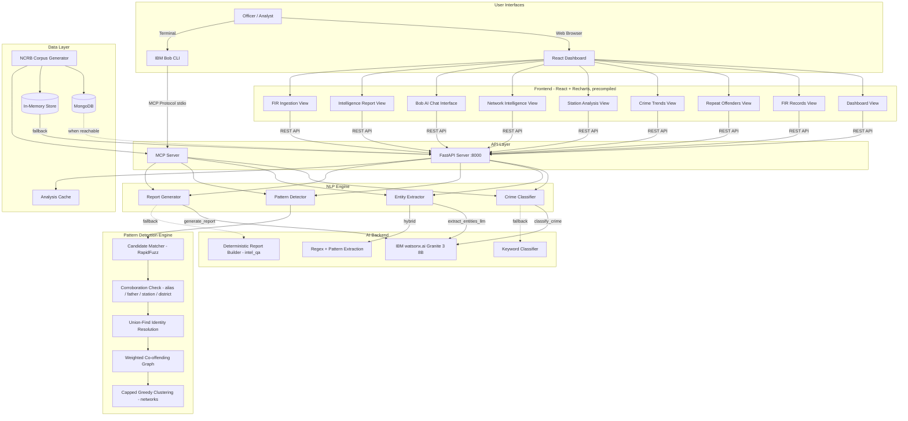

# Architecture

## System Architecture Diagram

## Component Table

| Component | Technology | Responsibility |
|-----------|-----------|----------------|
| React Dashboard | React 18, Vite, Tailwind CSS, Recharts | Interactive visualization of crime intelligence |
| FastAPI Server | Python 3.11, FastAPI, Pydantic | REST API serving processed FIR data and analytics |
| MCP Server | Python, MCP Protocol (stdio) | IBM Bob CLI integration with 6 intelligence tools |
| Crime Classifier | IBM watsonx.ai Granite 3 + fallback rules | Categorizes FIRs into 15 crime types |
| Entity Extractor | Hybrid: watsonx.ai + regex patterns | Extracts accused, victims, locations, MO, IPC sections |
| Pattern Detector | RapidFuzz, custom algorithms | Cross-FIR matching, repeat offender detection, network identification |
| Report Generator | watsonx.ai Granite 3 + templates | Generates station-level summaries and intelligence reports |
| FIR Data Store | MongoDB when reachable, in-memory fallback | 100 generated NCRB-distribution FIRs across 13 UP districts |

## Data Flow

1. FIR Text Input (JSON batch)
2. Crime Classification (watsonx.ai -> crime_type)
3. Entity Extraction (accused, victims, locations, MO, IPC sections)
4. Severity Scoring (base crime score + modifiers)
5. Cross-FIR Pattern Detection (fuzzy matching, alias resolution, MO fingerprinting)
6. Output Generation (repeat offenders, station summaries, crime networks, reports)

## Security Notes

- No real PII - all FIR data is realistic but fictional (mock data)
- .env with watsonx.ai credentials is gitignored
- CORS configured for local development
- No data persisted to disk - all analysis is in-memory
